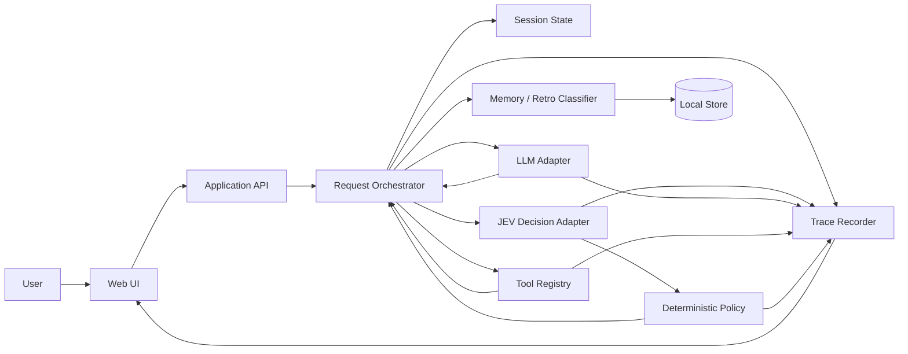
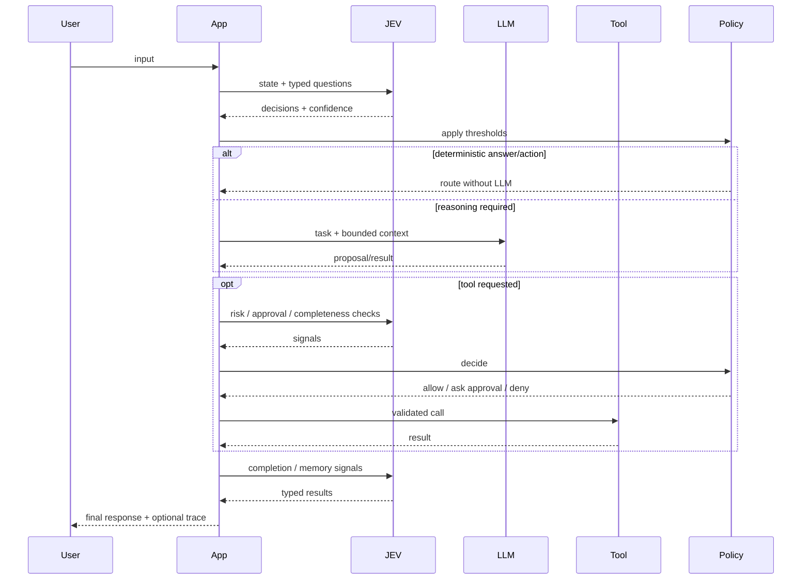

# System design

## Logical architecture



## Core responsibility split

### UI

Renders conversation and execution trace. It contains no orchestration logic.

### Application API

Accepts input, exposes sessions/traces, and invokes the application service.

### Request orchestrator

Coordinates a single turn. It is deliberately small. It should read like application code rather than a framework.

Its job is to:

1. normalize input,
2. load session state,
3. ask relevant JEV questions,
4. apply deterministic policy,
5. invoke an LLM only if selected,
6. validate any proposed action,
7. invoke tools when allowed,
8. evaluate outcome/completion,
9. persist state and trace.

### JEV decision adapter

Takes a state plus typed questions and returns typed answers, probabilities/confidence and metadata.

It must not execute business actions.

### Deterministic policy

Owns thresholds and consequences.

Example:

```ts
if (decision.risk >= policy.requireApprovalAt) {
  return { kind: "needs_approval" };
}
```

Do not bury thresholds inside prompts.

### LLM adapter

Used for tasks such as decomposition, synthesis, explanation, transformation or ambiguous reasoning.

The app owns model selection. JEV may provide a routing signal, but code maps that signal to an allowed model.

### Tools

Tools are explicit functions with schemas. A tool has:

- id,
- input schema,
- execution function,
- risk metadata,
- optional approval requirement.

### Session state

State required to continue the interaction. Keep it compact and explicit.

Do not make the full transcript the only state model.

### Memory / retrospective extraction

At the end of a turn or session, candidate signals can be classified into:

- ephemeral — useful only now,
- short-term — useful for this active task/session,
- retrospective — useful for analysing what happened,
- long-term — potentially reusable later,
- discard.

Persistence remains an application decision.

## Execution pattern



## Initial deployment topology

One application, one local database, external AI APIs.

No queue, no distributed event bus, no separate worker until a real workload requires one.
