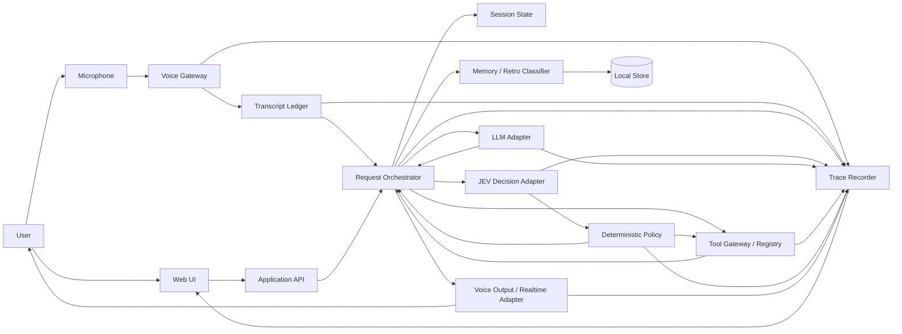
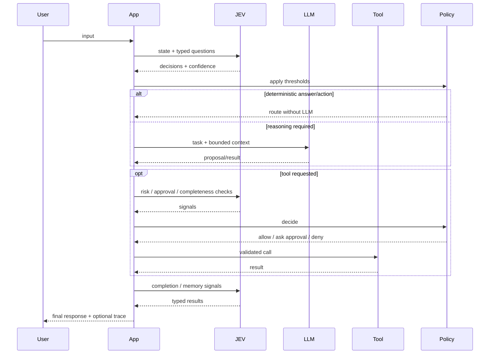
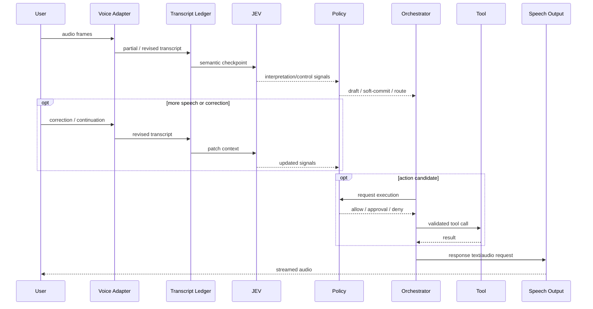

# System design

## Logical architecture

Voice and text are both first-class inputs. Voice adds a revision-aware ingress layer before the same application policy/tool boundaries.



For detailed voice semantics, read [08-voice-architecture.md](08-voice-architecture.md).

## Core responsibility split

### UI

Renders conversation and execution trace. It contains no orchestration logic.

For voice it may show provisional/revised transcript state and must be able to stop stale assistant playback on interruption.

### Voice Gateway

Owns provider/transport-specific realtime voice mechanics and emits canonical speech events.

It may represent either:

- a streaming STT/control-first path; or
- a native speech-to-speech provider session.

Provider SDK event objects stay inside this boundary.

### Transcript Ledger

Preserves the evolution of a spoken utterance rather than overwriting a single transcript string.

It records:

- partial hypotheses,
- provider revisions,
- final transcript segments,
- user semantic corrections,
- utterance boundaries,
- interruption/cancellation relationships.

The ledger is evidence/state. It does not itself authorize actions.

### Application API

Accepts text input, exposes sessions/traces, and invokes the application service.

Realtime voice transport may use WebSocket separately from ordinary HTTP APIs.

### Request orchestrator

Coordinates semantic work. It is deliberately small. It should read like application code rather than a framework.

Its job is to:

1. normalize text or a voice semantic checkpoint,
2. load session state,
3. ask relevant JEV questions,
4. apply deterministic policy,
5. invoke an LLM only if selected,
6. validate any proposed action,
7. invoke tools when allowed,
8. evaluate outcome/completion,
9. persist state and trace.

Do not invoke this entire flow for every raw transcript delta.

### JEV decision adapter

Takes state plus typed questions and returns typed answers, probabilities/confidence and metadata.

It must not execute business actions.

For voice, JEV can consume bounded semantic checkpoints consisting of new text, a rolling transcript tail, active structured events and relevant session state.

### Deterministic policy

Owns thresholds and consequences.

Example:

```ts
if (decision.risk >= policy.requireApprovalAt) {
  return { kind: "needs_approval" };
}
```

Do not bury thresholds inside prompts.

A transcript becoming final does not bypass policy.

### LLM adapter

Used for tasks such as decomposition, synthesis, explanation, transformation or ambiguous reasoning.

The app owns model selection. JEV may provide a routing signal, but code maps that signal to an allowed model.

Per-task model routing is separate from selecting the provider/model for an already-open realtime voice session.

### Tool Gateway

Tools are explicit functions with schemas. A tool has:

- id,
- input schema,
- execution function,
- risk metadata,
- optional approval requirement.

All consequential actions pass through this gateway whether proposed by the text agent or a native realtime voice model.

### Session state

State required to continue the interaction. Keep it compact and explicit.

Do not make the full transcript the only state model.

For voice, durable application state should refer to structured events/utterances rather than relying on raw audio.

### Memory / retrospective extraction

At the end of a turn or session, candidate signals can be classified into:

- ephemeral — useful only now,
- short-term — useful for this active task/session,
- retrospective — useful for analysing what happened,
- long-term — potentially reusable later,
- discard.

Persistence remains an application decision.

## Text execution pattern



## Control-first voice execution pattern



## Native realtime voice pattern

A native speech-to-speech provider may hear the user's audio before JEV receives any transcript.

In that mode JEV is not a pre-model filter. The application retains control at tool execution, approval, durable mutation, memory persistence and workflow boundaries.

See [ADR 0004](adr/0004-voice-control-plane.md).

## Initial deployment topology

One application, one local database, external AI APIs.

Use HTTP for ordinary APIs, WebSocket where realtime voice streaming requires it, and SSE for the inspector event stream.

No queue, no distributed event bus, no separate worker until a real workload requires one.
