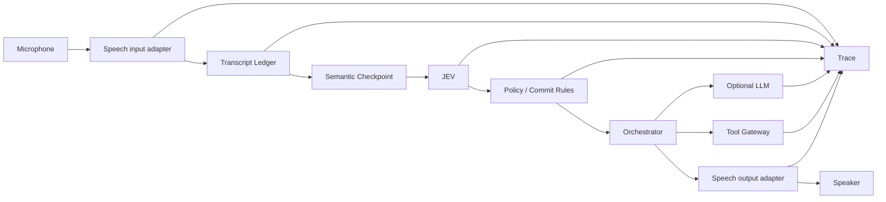
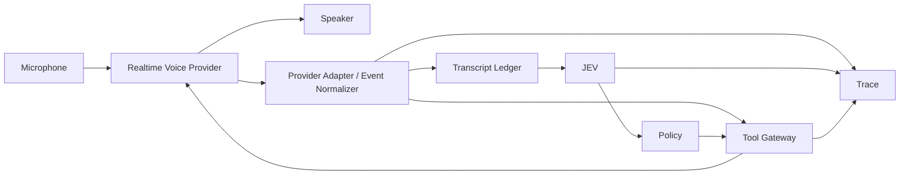

# Voice architecture

Voice is a first-class ingress/egress path for the JEV POC, not a microphone bolted onto the text API.

The design must support both:

1. **control-first voice** — speech is transcribed into revisable text/events before JEV/LLM/action execution; and
2. **native realtime voice** — a speech-to-speech model owns the conversational loop while the application still owns tools, approvals, durable state and telemetry.

The POC should prove the control-first path first because it exposes the signal JEV is meant to reason over.

## Architectural invariant

```
audio is evidence
transcript is revisable state
JEV produces semantic/control signals
policy decides what may commit
tools perform side effects
```

A transcript becoming "final" is **not** permission to execute an action.

## Two supported voice modes

### Mode A — STT-first / control-first

Preferred for the first voice implementation.



Why this mode matters:

- we can inspect partial and revised transcripts before expensive reasoning;
- JEV can work on semantic checkpoints rather than a whole completed utterance;
- user corrections can patch an in-progress interpretation;
- action commit rules remain under application control;
- STT, LLM and TTS providers can evolve independently.

### Mode B — native realtime speech-to-speech

Use when natural conversational latency/expressiveness matters more than inspecting text before the voice model reasons.



Important limitation:

With native speech-to-speech, the connected voice model receives audio before our JEV layer can interpret a transcript. Therefore JEV cannot be treated as a pre-model filter.

The control boundary moves to:

- tool execution,
- approval,
- durable state mutation,
- memory persistence,
- follow-up workflow execution.

Provider-native conversational responses may stream immediately, but consequential actions still pass through application policy.

## Do not force both modes into one fake abstraction

They have different control points.

Share:

- canonical event types,
- transcript/revision semantics,
- correlation identifiers,
- tool gateway,
- policy,
- trace model,
- session state.

Keep provider/mode-specific transport mechanics inside adapters.

## Canonical speech events

Provider SDK objects must not leak into core.

A minimal event model:

```ts
type SpeechEvent =
  | {
      type: "speech.started";
      sessionId: string;
      utteranceId: string;
      at: number;
    }
  | {
      type: "transcript.partial";
      sessionId: string;
      utteranceId: string;
      revision: number;
      text: string;
      at: number;
    }
  | {
      type: "transcript.revised";
      sessionId: string;
      utteranceId: string;
      revision: number;
      replacesRevision: number;
      text: string;
      at: number;
    }
  | {
      type: "transcript.final";
      sessionId: string;
      utteranceId: string;
      revision: number;
      text: string;
      at: number;
    }
  | {
      type: "speech.ended";
      sessionId: string;
      utteranceId: string;
      at: number;
    }
  | {
      type: "response.interrupted";
      sessionId: string;
      responseId: string;
      at: number;
    };
```

Provider-specific confidence, timing and raw metadata can be attached as optional metadata and retained in the trace.

## Transcript Ledger

Do not overwrite one `transcript` string.

The ledger stores the evolution of an utterance.

Example:

```
r1  "today I drank 200 ml coke"
r2  "today I drank 200 ml coke ah no"
r3  "today I drank 200 ml water"
                     ^ provider/user revision
```

The ledger lets us distinguish:

1. **STT revision** — the speech provider changes what it believes was said;
2. **semantic correction** — the user intentionally changes meaning, e.g. "Coke — no, water."

Those are not equivalent.

The second should become an application-level patch to interpreted state.

## Input/event normalization is not semantic intelligence

The deterministic stage before JEV only wraps facts the application already knows: session/utterance IDs, transcript revision, timestamp, source, known permissions, available tools and active state references.

It does **not** decide what the user means.

For continuous speech, a separate **Semantic Checkpoint Scheduler** decides when enough potentially useful evidence has accumulated to justify a JEV call. The scheduler uses cheap mechanical signals such as stable/final STT segments, pauses/VAD, elapsed time, amount of new text, correction hints and speech-end.

The scheduler answers only **"when should we ask JEV?"**. JEV answers **"what does this mean?"**.

See [16 — Streaming input and semantic checkpoint scheduler](16-streaming-checkpoint-scheduler.md) for the full yapping/continuous-speech design, trade-offs and eval plan.

## Semantic checkpoints

Do not invoke the full agent loop on every transcript token.

Feed JEV when the checkpoint scheduler determines there is useful new semantic evidence, for example:

- a stable transcript segment,
- a short pause,
- provider chunk finalisation,
- an explicit correction,
- a likely task boundary,
- end of turn.

Input to JEV should be bounded:

```
new text
+ rolling transcript tail
+ active structured events
+ relevant session state
```

This keeps latency and cost controlled while still letting the UI react provisionally.

## Interpretation lifecycle

For voice-derived actions use:

```
draft
  -> soft commit
  -> patch / merge
  -> sealed
```

### Draft

A provisional interpretation. Safe to show in UI. Not executable.

### Soft commit

Enough evidence exists to create/update a pending structured event, but it remains revisable inside a correction horizon.

### Patch / merge

Later speech modifies the event instead of creating a duplicate.

Example:

```
"I drank 200 ml Coke ... no, water"
```

should patch one hydration/event candidate rather than store two independent facts.

### Sealed

The event is stable enough for durable persistence or downstream execution according to policy.

Consequential actions can still require approval after sealing.

## Turn detection and interruption

Voice turn handling is part of architecture.

The adapter must normalize:

- speech start/end,
- provider VAD or semantic-turn signals,
- user barge-in,
- assistant response cancellation,
- output playback completion.

On barge-in:

1. stop/cancel assistant playback quickly;
2. mark the previous response as interrupted;
3. continue receiving user audio;
4. preserve correlation so the trace explains what was heard, cancelled and resumed.

Do not let stale assistant audio continue playing after the user has interrupted.

## Voice provider abstraction

The application should support direct providers such as OpenAI Realtime, Gemini Live and xAI/Grok Voice without making Azure or another orchestration framework the mandatory voice layer.

Use application-owned capabilities rather than one giant generic SDK wrapper.

Conceptually:

```ts
interface SpeechInput {
  pushAudio(frame: AudioFrame): Promise<void>;
  events(): AsyncIterable<SpeechEvent>;
}

interface SpeechOutput {
  speak(request: SpeakRequest): AsyncIterable<OutputAudioEvent>;
  cancel(responseId: string): Promise<void>;
}

interface RealtimeVoiceSession {
  sendAudio(frame: AudioFrame): Promise<void>;
  sendToolResult(result: ToolResult): Promise<void>;
  cancelResponse(): Promise<void>;
  events(): AsyncIterable<RealtimeVoiceEvent>;
}
```

Implement only interfaces required by the selected mode.

## Provider selection

As of 2026-09-25, OpenAI Realtime, Gemini Live and xAI/Grok Voice all expose realtime audio experiences and tool/function integration, but their session/event models differ.

The repo should therefore record a provider's capabilities instead of hard-coding its event names into core.

Useful capability flags:

```ts
type VoiceCapabilities = {
  nativeSpeechToSpeech: boolean;
  streamingInputTranscript: boolean;
  inputTranscriptRevisions: boolean;
  outputTranscript: boolean;
  serverVad: boolean;
  semanticTurnDetection: boolean;
  bargeIn: boolean;
  toolCalling: boolean;
  asyncTools: boolean;
  clientDirectAuth: "ephemeral-token" | "server-only" | "both";
};
```

Do not assume all fields can be implemented identically by all providers.

### Current provider notes

- **OpenAI Realtime** — native realtime multimodal/speech-to-speech over low-latency transports including WebRTC/WebSocket; input transcription is a separate asynchronous ASR process and should be treated as guidance rather than exactly what the realtime model heard.
- **Gemini Live** — bidirectional realtime audio over WebSocket with input/output transcription, tool calling and interruption/barge-in support.
- **xAI/Grok Voice** — realtime speech-to-speech over WebSocket, server VAD, transcript/audio events and function/tool calling.

These are adapters, not architectural dependencies.

## Model routing vs voice-session selection

Keep these separate.

### Voice-session selection

Normally happens when opening a realtime voice session:

```
voice provider + voice model + voice persona + transport
```

Do not continuously swap native voice providers/models mid-sentence just because JEV classifies one fragment as "complex."

### Reasoning/model routing

Can happen per semantic task:

```
JEV signal
  -> deterministic policy
  -> deterministic handler OR fast text model OR reasoning model
```

A realtime voice model may remain the conversational shell while a backend reasoning model performs a bounded task.

This separation avoids coupling speech UX to reasoning-model routing.

## Tool calls

All consequential tools should go through the application's Tool Gateway.

For native voice providers:

```
voice provider proposes tool
  -> normalize proposal
  -> validate schema
  -> JEV risk / intent / completeness signals
  -> deterministic policy
  -> approval if required
  -> execute
  -> send tool result back to voice session
```

For STT-first mode, the same Tool Gateway is used after JEV/LLM interpretation.

The voice provider must not bypass this path.

## Observability

Correlate one spoken interaction end to end:

```
audio/session
  -> speech event
  -> transcript revision
  -> semantic checkpoint
  -> JEV decision
  -> policy
  -> LLM call
  -> tool proposal
  -> approval
  -> tool result
  -> generated/spoken response
  -> interruption/cancellation
```

The inspector should be able to replay the **event timeline** without needing to retain raw audio.

Raw audio retention should be off by default for the POC.

## First implementation

The first voice slice should be deliberately small:

1. microphone capture in browser;
2. one streaming STT provider;
3. normalized partial/final/revision events;
4. Transcript Ledger;
5. one JEV semantic checkpoint;
6. provisional UI;
7. one simple structured action candidate;
8. correction/patch behavior;
9. trace all events.

Only after that is stable, add native speech-to-speech mode.

This demonstrates the reason JEV exists more clearly than starting with a fully opaque realtime voice loop.

## Provider references

Provider capabilities change quickly. Re-check official docs when implementing an adapter:

- OpenAI Realtime API: https://platform.openai.com/docs/api-reference/realtime
- Gemini Live API: https://ai.google.dev/gemini-api/docs/live-api
- xAI Voice: https://docs.x.ai/developers/model-capabilities/audio/voice
